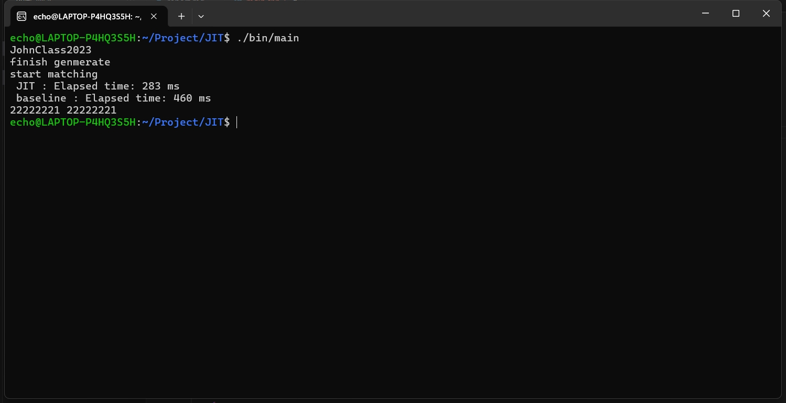

## JIT report

### 环境配置：

使用 vscode + 命令行环境进行配置

1. 首先是 clone 了 asmjit 的 Github 仓库，然后按照官方文档的教程对 asmjit 仓库进行 cmake，得到相应的 makefile
2. 在提供的 CMakeList 文件上做修改， 将编译好的 asmjit 库链接到我们的主函数 `main.cpp` 上

```cmake
include("${ASMJIT_SOURCE_DIR}/CMakeLists.txt")
target_Link_Libraries(main asmjit ${ASMJIT_DEPS})
```

### 完成过程：

```cpp
    JitRuntime rt;
    CodeHolder code;
    code.init(rt.environment(),
              rt.cpuFeatures());
    x86::Compiler cc(&code);

    // 声明基本的寄存器，存储模式串，待匹配串，模式串长度，匹配位置等变量
    FuncNode *funcNode = cc.addFunc(FuncSignature::build<bool, const char *>());
    x86::Gp str_ptr = cc.newGpq("str_ptr");
    x86::Gp mode_ptr = cc.newGpq("mode_ptr");
    x86::Gp vRet_t = cc.newGpd();
    x86::Gp vRet_f = cc.newGpd();
    x86::Gp index = cc.newGpd("index");
    x86::Gp pattern_len = cc.newGpd("pattern_len");

    // 对声明的寄存器/变量进行初始化
    funcNode->setArg(0, str_ptr);
    cc.mov(mode_ptr, mode);
    cc.mov(vRet_t, (bool)(true));
    cc.mov(vRet_f, (bool)(false));
    cc.mov(pattern_len, mode_len);
    cc.mov(index, 0);

    // matched_label 控制逐位匹配的循环
    // end_label 控制匹配失败
    Label matched_label = cc.newLabel();
    Label end_label = cc.newLabel();

    // 检测模式串长度是否为 0
    cc.test(pattern_len, pattern_len);
    cc.jz(end_label);

    // 逐位匹配循环
    cc.bind(matched_label);
    x86::Gp value_model = cc.newGpb("value_model");
    cc.mov(value_model, x86::byte_ptr(mode_ptr));
    x86::Gp value_str = cc.newGpb("value_str");
    cc.mov(value_str, x86::byte_ptr(str_ptr));
    cc.cmp(value_model, value_str);
    cc.jne(end_label);
    cc.add(str_ptr, 1);
    cc.add(mode_ptr, 1);
    cc.inc(index);
    cc.cmp(index, pattern_len);
    cc.jl(matched_label);

    cc.ret(vRet_t);
    cc.bind(end_label);
    cc.ret(vRet_f);

    cc.endFunc();
    cc.finalize();
```

主要的思路就是将读入的待匹配串和预先记录好的模式串进行逐位匹配，通过 `matched_label` 来进行循环的控制，记录 `index` 作为当前匹配的位置。

需要注意的地方：

- 我们在使用 `cmp` 函数时要注意，`x86::byte_ptr(str_ptr)` 返回的是这个寄存器对应的地址，并不是寄存器的值。所以进行比较前，我们需要先拿出目标地址的元素值再进行比较

- 在拿取地址对应的元素值是要注意寄存器的类型，`asmjit` 的库提供了许多寄存器类型 `newGp, newGpw, newGpu` 等，但是在这里我们需要的是对 `char` 字符的提取，所以选择了 `newGpb`

### 实现结果：



### 性能分析：

未开 `O3` 时的性能分析，模式串长度大约为 10，JIT 和 baseline 每组用时均是在相同的数据上统计的

| JIT (ms) | baseline (ms) |
| -------- | ------------- |
| 304      | 466           |
| 290      | 500           |
| 358      | 551           |
| 219      | 329           |
| 327      | 539           |
| 328      | 502           |
| 454      | 786           |
| 294      | 515           |
| 208      | 311           |
| 325      | 494           |
| 189      | 264           |
| 325      | 496           |
| 300      | 519           |
| 281      | 400           |
| 542      | 643           |
| 334      | 443           |
| 376      | 627           |
| 503      | 721           |
| 433      | 465           |
| 406      | 600           |

JIT 组用时： 平均值: 339.80 ms, 标准差: 89.90 ms

baseline 组用时： 平均值: 508.55 ms, 标准差: 125.86 ms

结论 ：

1. 使用了 JIT 后程序的性能确实得到了提升，平均提升了 170 ms 左右，同时 JIT 的标准差比较小说明在不同的输入数据的处理上也更加稳定
2. 在使用了 O3 优化后，JIT 组相比 baseline 就没有太明显提升，甚至在某些组数据中 baseline 的速度还更快

分析：

在不使用 `O3` 的情况下， 利用 `asmjit` 的库我们可以直接使用 `x86` 指令集等更加贴近底层机器语言的指令，相比 C++ 代码省去了很多解释执行时的步骤，优化了程序的性能。同时 `asmjit` 支持根据硬件架构动态生成生成优化的指令序列，这相当于对程序开启了 `O2, O3` 优化，所以对于没有进行优化的 baseline 来说，JIT 这种即时编译的方法在运行速度上会快很多。
